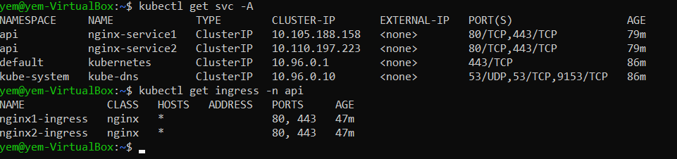

# ТЗ к проекту

Требуется реализовать:
Kubernetes node на Ubuntu 24

namespace: api

deploy + service: 
- app1 (2 реплики) - nginx или node.js app - просто отдает любую страницу
- app2 (2 реплики) - nginx или node.js app - просто отдает любую другую(!) страницу

NGINX Ingress Controller:
- /app1: 80, 443 -> app1: 80
- /app2: 80, 443 -> app2: 80

# Реализация

Тестовая среда на виртуальной машине была развернута при помощи ansible, для чего была написана роль: 
* скачаны gpg ключи и добавлены репозитории в apt
* скачан docker, minikube, kubectl
* пользователю добавлена группа докера

Ingress настроен на прием как трафика с 80 так и 443 портов. Также создан ssl ключ и настроен tls для ingress

Все листинги файлов представлены представлены в папках ansible и manifests

